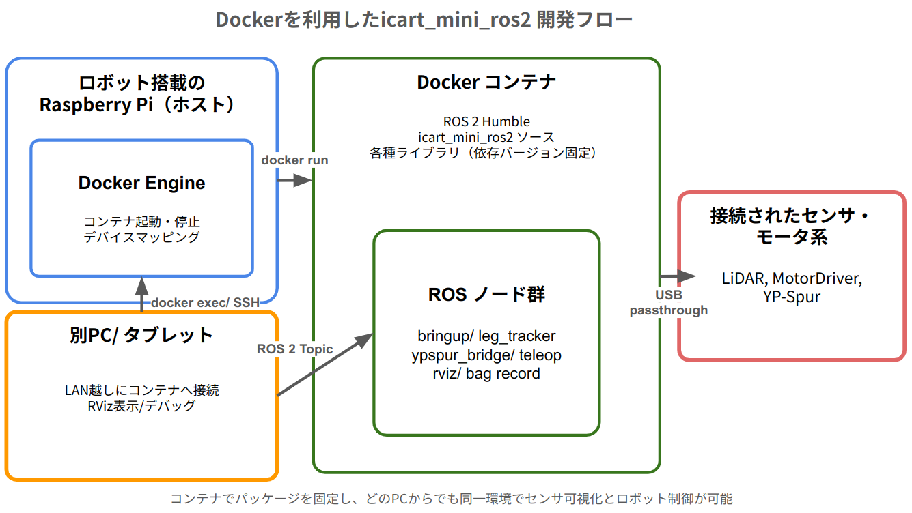

# 1年間の成果サマリ（Year in Review）

本ページは、icart_mini_ros2 の過去1年間の取り組みを振り返る報告用サマリです。

## ハイライト

### 走行
YP-Spur ブリッジが `/cmd_vel` → 走行を実現し、`/odom`・`/joint_states`・TF を配信。URDF+RViz で動作を可視化。  
 +  +   

### センサ
Hokuyo UST-10LX を [urg_node2](https://github.com/Hokuyo-aut/urg_node2)（北陽電機公式 ROS 2 ドライバ）で接続し、/scan 配信や RViz 可視化、バッグ記録の手順を整備。   

### 基板
24V→5V電源、インジケータ、電圧計測、ブザーを備えた Raspberry Pi 拡張ボードを活用。  

### 追従
karugamoのソースコードを参考に、LiDAR 脚クラスタ検出・ID追跡・Follow-me を実装。  
  
  
  

### Docker / 開発環境
ロボット搭載 Raspberry Pi 上で Docker により環境を固定化し、別PCから同一設定で操作・可視化可能に整備。

1. **ロボット搭載の Raspberry Pi（ホスト）** が `docker run` を実行し、USBデバイス(`/dev/ttyACM0` 等)や X11/Wayland をコンテナへ共有。
2. **Docker Engine（Raspberry Pi 上）** が ROS 2 Humble コンテナを起動し、`icart_mini_ros2` と依存を固定。
3. **Dockerコンテナ内部** では `icart_mini_bringup` / `icart_mini_ypspur_bridge` / `icart_mini_leg_tracker` / `teleop_twist_joy` / `rviz` 等が動作。
4. **センサ・モータ系（LiDAR / YP-Spur / エンコーダ）** は USB パススルーで連携し、制御指令と計測データを ROS トピックに反映。
5. **別PCやタブレット** は WiFi 越しに `docker exec` / SSH / GUI 転送で接続し、rviz表示やデバッグ、ログ取得を同一環境で再現。

## 課題
- 障害物が多い環境下での追従性向上、主に乗り移り対策
- 充電回路、バッテリー電圧計測回路の修正

## 所感（開発メモ）
- 困ったことは特になし（安定して開発・運用）
- 初期に会社PCでYP-Spurを動かそうとした際に“煙くさい”事象があり要注意（以後は問題なし）
- 以降は安定して動作。急な暴走などはなし（感謝）
- 家の中で開発する分にはちょうどよい大きさで取り回しが良い
- 大学生のときに欲しかった、研究室ではKobukiというお掃除ロボットみたいなロボットを使用しており、使い勝手はいまいちだった。

## 1年のタイムライン

| 期間 | 四半期 | 主な取り組み |
|---|---|---|
| 2024-11-21 ~ 2025-02-18 | Q1 | 環境整備（Docker/依存パッケージ）、YP-Spur ブリッジ導入、Bringup/URDF/RViz の基盤整備 |
| 2025-02-20 ~ 2025-03-09 | Q2 | LiDARクラスタリング・トラッキング実装、Follow target/PID 制御の初期版 |
| 2025-03-10 ~ 2025-04-30 | Q3 | ログ/可視化/メッセージ拡充、ロスト復帰や選定ロジックの強化、安定化 |
| 2025-05-01 ~ 2025-09-23 | Q4 | パラメータチューニング（BLDC/DC切替含む）、追従性改善、各種バグ修正と最終調整 |
